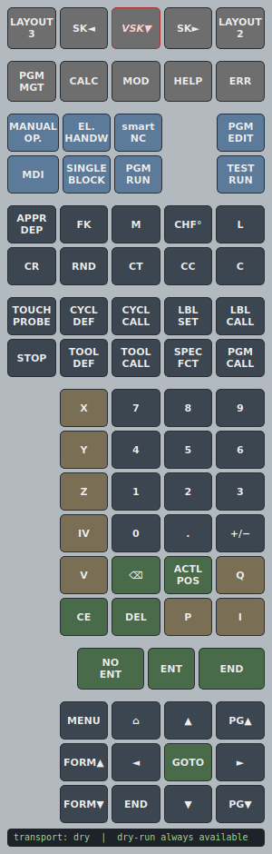
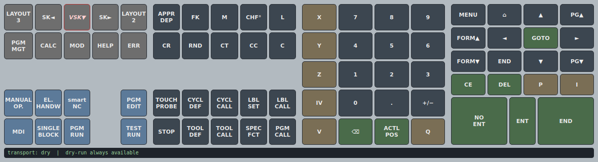

# Native TNC 640 keypad

A small, native, cross‑platform on‑screen keypad for the HEIDENHAIN **TNC 640
programming station** running under VirtualBox on UNIX‑like systems (Linux,
macOS, …). It replaces the Windows‑only `keypad.exe` ("steering panel") with a
clean‑room reimplementation.

It reproduces **both** original NC panel layouts and, for every button, sends the
**same keypress** the original would — by default through VirtualBox's
`putScancodes`, which is exactly what `keypad.exe` itself does for a VBox VM
(`IKeyboard::putScancodes`). No HEIDENHAIN code or icons are used; labels are plain
text and every key code is documented in
[`../docs/12-keypad-keymap.md`](../docs/12-keypad-keymap.md).

| **Vertical** (`--layout vertical`, default) | **Horizontal** (`--layout horizontal`) |
|:---:|:---:|
| from `keypad.exe -nv`, the panel the desktop launcher opens | from `keypad.exe -n` |
|  |  |

> Clean‑room: the mapping was reconstructed from the keypad's QML (button →
> `operation` string), the guest keymap (`keymap_te530_*_vbox.xml`), the
> relation *X‑keycode = Linux keycode + 8*, and the standard AT scancode set 1 —
> then **validated live** against the running control. See the legal note in
> [`../docs/09-legal.md`](../docs/09-legal.md).

## Install

```sh
python3 -m venv .venv && . .venv/bin/activate     # optional but recommended
pip install -r requirements.txt                   # PySide6
```

`VBoxManage` must be on your `PATH` (it is, after installing VirtualBox).

## Run

```sh
# Vertical panel (default) -> running VirtualBox VM named "TNC640":
python3 tnc_keypad.py --vm TNC640

# Horizontal panel instead:
python3 tnc_keypad.py --layout horizontal --vm TNC640

# Develop / inspect codes without a VM (prints what would be sent):
python3 tnc_keypad.py --transport dry

# Render a layout to a PNG and exit (works headless):
QT_QPA_PLATFORM=offscreen python3 tnc_keypad.py --layout vertical --screenshot preview-vertical.png
```

Hover any button to see its `operation`, the AT scancodes, and the `heuinput`
tokens it sends. The one key still being confirmed (`VSK▼`, vertical soft‑key
scroll‑down) is drawn in red italic and is a no‑op until verified.

## Transports

| `--transport` | What it does | Needs |
|---|---|---|
| `vbox` *(default)* | `VBoxManage controlvm <vm> keyboardputscancode …` — AT set‑1 scancodes, host‑side. **This is what the original keypad.exe does for VBox.** | VirtualBox; `--vm NAME` |
| `heuinput` | Writes `KP/KR <linux‑keycode>` to the guest FIFO `/tmp/__heuinput`. Faithful to the keypad.exe VM path. | guest `heuinput` running + a delivery command via `--heu-cmd` |
| `dry` | Prints the codes; sends nothing. | nothing |

`heuinput` example (delivering tokens over SSH into the guest):

```sh
python3 tnc_keypad.py --transport heuinput \
  --heu-cmd "ssh -p 2222 user@127.0.0.1 'cat >> /tmp/__heuinput'"
```

## Soft keys (F1–F8)

The original NC keypad (the TE 530) does **not** carry the 8 horizontal soft
keys — those live on the screen unit. So this panel doesn't either. To press a
soft key, click it directly on the control's screen or press **F1–F8** on your
PC keyboard (they reach the control unchanged).

## Files

| File | Purpose |
|---|---|
| `tnckeymap.py` | The mapping: `operation` → Linux keycode (+ modifiers) → AT set‑1 scancodes / `heuinput` tokens. Run it directly to dump the full table and self‑test. |
| `transport.py` | The three delivery backends (`vbox`, `heuinput`, `dry`). |
| `tnc_keypad.py` | The PySide6 GUI: both panel layouts (`vertical` = qml_07, `horizontal` = qml_08) + wiring. Both drive the exact same key codes. |
| `requirements.txt` | PySide6. |

## Validation status

Sent through the `vbox` transport against the live TNC 640 (demo mode):

- **no modifier:** `CE` (clears entry / dialogs), soft‑key 1 (F1).
- **Ctrl+Alt combos:** `MOD` (opens settings), `EDIT` (→ Programming mode),
  `PGMMGT` (opens file management).

All produced the expected control behaviour, confirming both the codes and the
modifier handling. Operations that are context‑gated by the control (e.g.
`PGMMGT` only opens file management in Programming mode) behave exactly as on
the real machine.
